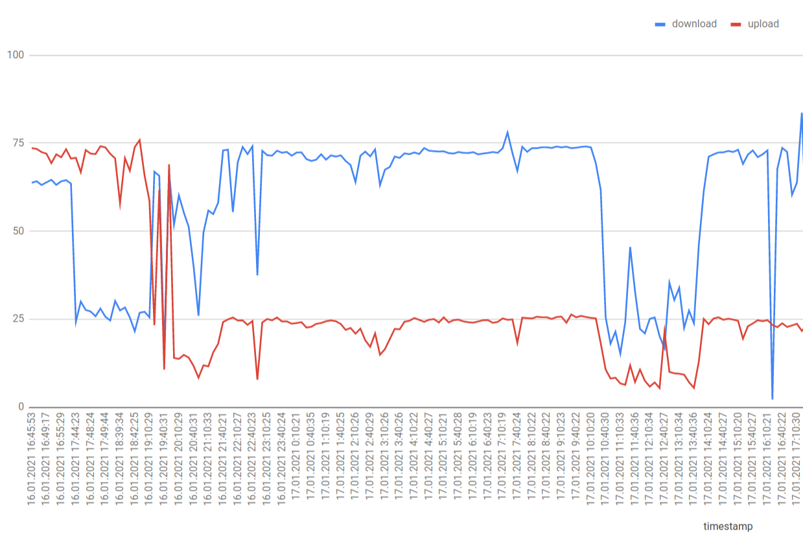

# Speedtest Log

Track regular Speedtest results (Download, Upload, Latency) and view on a line graph.



# Installation

**Note:** You have to have `speedtest` CLI installed (see https://www.speedtest.net/apps/cli)

## 1. Bundle all gems

Run `bundle install` to install everything from `Gemfile`

## 2. Initialize the database

Run `rake db:create_with_schema`

## 3. Setup crontab to have regular speedtests

Set up RVM for crontab:

```
rvm cron setup
```

Edit crontab:

```
crontab -e
```

Add this line to run [every 10 minutes](https://crontab.guru/#*/10_*_*_*_*)

```
*/10 * * * * $(which ruby) /your_path/speedtest_log/speedtest_log.rb
```

# Usage

Run `rackup web/config.ru` and visit `http://localhost:3000` to see a
graph.

There will be no data at first, you can wait until cron job runs or do a [manual run](#manual-run)
## Manual run

To manually log a Speedtest result:

```
./speedtest_log.rb
```

Show last 10 results:

```
./speedtest_log.rb show
```
