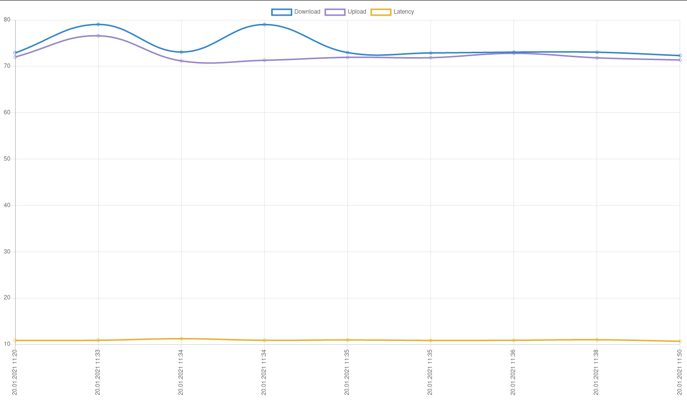

# Speedtest Log

Track regular Speedtest results (Download, Upload, Latency) and view on a line graph.



# Installation

## Setup a database


# Usage

**Note:** You have to have:
- `speedtest` CLI installed (see https://www.speedtest.net/apps/cli)
- `sqlite3` gem installed

Log Speedtest result:

```
./speedtest_log.rb
```

Show last 10 results:

```
./speedtest_log.rb show
```

## crontab

Set up RVM for crontab:

```
rvm cron setup
```

Edit:

```
crontab -e
```

Add this line to run [every 10 minutes](https://crontab.guru/#*/10_*_*_*_*)

```
*/10 * * * * $(which ruby) /home/<username>/your/path/speedtest_log.rb
```
